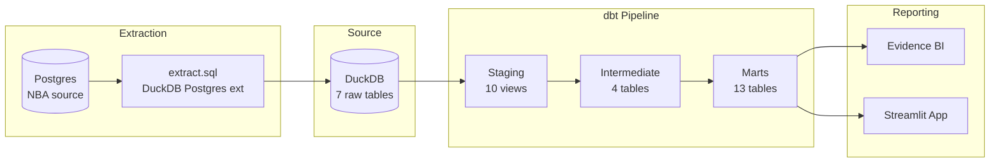

# Architecture

## System Overview

dbt_nba implements a three-layer medallion architecture (staging → intermediate → marts) producing a star schema consumed by two reporting frontends. Source data is extracted daily from Postgres via a CI/CD pipeline.



## Layer Architecture

```mermaid
graph TB
    subgraph Staging ["Staging Layer (views)"]
        stg_games
        stg_line_scores
        stg_player_basic[stg_player_game_basic_stats]
        stg_player_adv[stg_player_game_adv_stats]
        stg_player_adv_ext[stg_player_game_adv_stats_extended]
        stg_team_basic[stg_team_game_basic_stats]
        stg_team_adv[stg_team_game_adv_stats]
        stg_shots[stg_player_shot_charts]
        stg_season[stg_season_thresholds]
        stg_team_season[stg_team_season_thresholds]
    end

    subgraph Intermediate ["Intermediate Layer (tables)"]
        int_games[int_games_enriched]
        int_player[int_player_performance]
        int_team[int_team_performance]
        int_shots[int_player_shots_enriched]
    end

    subgraph Marts ["Marts Layer"]
        subgraph Dimensions
            dim_teams
            dim_players
            dim_seasons
            dim_dates
            dim_arenas
            dim_shot_zones
            dim_archetypes[dim_player_game_archetypes]
        end
        subgraph Facts
            fct_game[fct_game_results]
            fct_team[fct_team_game_stats]
            fct_player[fct_player_game_stats]
            fct_quarter[fct_quarter_scoring]
            fct_shots[fct_player_shots]
            fct_shooting[fct_player_game_shooting]
        end
    end

    stg_games --> int_games
    stg_team_basic --> int_team
    stg_team_adv --> int_team
    stg_player_basic --> int_player
    stg_player_adv_ext --> int_player
    stg_shots --> int_shots
    stg_player_basic --> int_shots
    int_team --> int_games

    int_games --> fct_game
    int_team --> fct_team
    int_player --> fct_player
    int_player --> dim_archetypes
    int_shots --> fct_shooting
    int_shots --> fct_shots
    stg_line_scores --> fct_quarter
```



## Design Patterns

### Materialization Strategy

| Layer | Materialization | Rationale |
|-------|----------------|-----------|
| Staging | `view` | Lightweight; always reflects current source data |
| Intermediate | `table` | Expensive joins computed once; reused by multiple marts |
| Dimensions | `table` | Slowly changing; full rebuild on each run |
| Facts | `incremental` | Large tables; 30-day lookback window for efficiency |

### Incremental Strategy

All fact tables use a 30-day lookback window with surrogate key-based merge:
```sql

WHERE game_date >= (SELECT MAX(game_date) FROM {{ this }}) - INTERVAL '30 days'

```
This provides idempotent refreshes that handle late-arriving data without full rebuilds.

### Team Abbreviation Conforming

Team names change over time (relocations, rebrands). The `team_maps` seed provides temporal validity (`start_year`, `end_year`) to correctly map team abbreviations to full names across seasons:
```sql
LEFT JOIN {{ ref('team_maps') }} tm
    ON stats.team = tm.team_abbr
    WHERE season_start_year >= tm.start_year
    AND season_start_year < tm.end_year
```
All intermediate models apply this pattern.

### Surrogate Keys

All mart tables use `dbt_utils.generate_surrogate_key()` to create deterministic surrogate keys from natural keys, enabling idempotent incremental loads:
```sql
{{ dbt_utils.generate_surrogate_key(['game_id', 'player_id']) }} as player_game_key
```

### Star Schema Design

Fact tables reference dimension tables via surrogate keys (`team_key`, `player_key`, `date_key`, `season_key`, `arena_key`, `shot_zone_key`, `archetype_key`), enabling efficient analytical queries with dimension filtering.

### Dynamic Tiering

`stg_season_thresholds` and `stg_team_season_thresholds` compute per-season percentile breakpoints for player/team performance classification. `stg_player_game_adv_stats_extended` joins these thresholds to assign dynamic performance tiers that adjust per season rather than using fixed cutoffs.

## Reporting Architecture

### Evidence BI

- Node.js-based BI tool reading from a local DuckDB copy at `reports/sources/nba/dbt_nba.duckdb`
- 12 SQL query files in `reports/sources/nba/` powering dashboard visualizations
- Single-page dashboard (`reports/pages/index.md`) with embedded chart references
- Connection configured via `reports/sources/nba/connection.yaml`

### Streamlit Dashboard

- Python app at `streamlit_app/app.py` with 7 navigation pages
- Connects read-only to the same DuckDB database (`dbt_nba/reports/sources/nba/dbt_nba.duckdb`)
- Uses Plotly for interactive visualizations with `@st.cache_data` for query caching
- Queries the marts schema directly (`main_marts.*`, `main_intermediate.*`)

## Extraction Architecture

The source data pipeline (`scripts/`) extracts from a remote Postgres database:
1. `extract.sql` uses the DuckDB Postgres extension (`INSTALL postgres; LOAD postgres`)
2. Attaches Postgres via `POSTGRES_URL` environment variable
3. Drops and recreates all 7 source tables (destructive refresh)
4. `pipeline.sh` orchestrates: extract → dbt build → copy DB to reports
