# Data Models

## Star Schema Overview

```mermaid
erDiagram
    dim_teams ||--o{ fct_game_results : "home/visitor/winning_team_key"
    dim_teams ||--o{ fct_team_game_stats : "team_key"
    dim_teams ||--o{ fct_player_game_stats : "team_key"
    dim_teams ||--o{ fct_player_game_shooting : "team_key, opponent_key"
    dim_teams ||--o{ fct_player_shots : "team_key, opponent_key"
    dim_teams ||--o{ fct_quarter_scoring : "team_key, opponent_key"
    dim_players ||--o{ fct_player_game_stats : "player_key"
    dim_players ||--o{ fct_player_game_shooting : "player_key"
    dim_players ||--o{ fct_player_shots : "player_key"
    dim_dates ||--o{ fct_game_results : "date_key"
    dim_dates ||--o{ fct_player_game_stats : "date_key"
    dim_dates ||--o{ fct_player_game_shooting : "date_key"
    dim_dates ||--o{ fct_player_shots : "date_key"
    dim_dates ||--o{ fct_quarter_scoring : "date_key"
    dim_seasons ||--o{ fct_game_results : "season_key"
    dim_seasons ||--o{ fct_player_game_stats : "season_key"
    dim_seasons ||--o{ fct_player_shots : "season_key"
    dim_seasons ||--o{ fct_quarter_scoring : "season_key"
    dim_arenas ||--o{ fct_game_results : "arena_key"
    dim_arenas ||--o{ fct_player_game_stats : "arena_key"
    dim_shot_zones ||--o{ fct_player_shots : "shot_distance_zone"
    dim_player_game_archetypes ||--o{ fct_player_game_stats : "archetype_key"

    dim_teams {
        string team_key PK
        string team_abbr
        string team_full_name
    }
    dim_players {
        string player_key PK
        string player_id
        string player_name
    }
    dim_seasons {
        string season_key PK
        int season_start_year
    }
    dim_dates {
        string date_key PK
        date full_date
    }
    dim_arenas {
        string arena_key PK
        string arena_name
        string arena_city
    }
    dim_shot_zones {
        string shot_zone_key PK
        string shot_distance_zone
        int min_distance_ft
        int max_distance_ft
        int zone_order
        string zone_group
        string zone_category
        string shot_class
    }
    dim_player_game_archetypes {
        string archetype_key PK
        string usage_tier
        string impact_tier
        string shooting_efficiency_tier
        string minutes_based_role
        bool is_double_double
        bool is_triple_double
        bool is_versatile
        bool is_defensive_specialist
        bool is_three_and_d
    }
```

## Fact Table Details

### fct_game_results (grain: game)

| Column | Type | Description |
|--------|------|-------------|
| game_key | string | Surrogate key (from game_id) |
| date_key | string | FK → dim_dates |
| season_key | string | FK → dim_seasons |
| arena_key | string | FK → dim_arenas |
| home_team_key | string | FK → dim_teams |
| visitor_team_key | string | FK → dim_teams |
| winning_team_key | string | FK → dim_teams |
| home_points | int | Home team score |
| visitor_points | int | Visitor team score |
| point_differential | int | Absolute margin |
| total_points | int | Combined score |
| is_playoff | bool | Playoff game flag |
| is_overtime | bool | Overtime game flag |
| is_home_team_winner | bool | Home win flag |
| home_net_rating | float | Home team net rating |
| visitor_net_rating | float | Visitor team net rating |
| matchup_pace | float | Average pace of both teams |
| game_competitiveness_tier | string | Clutch/Competitive/Decisive/Blowout |

### fct_player_game_stats (grain: player × game)

| Column | Type | Description |
|--------|------|-------------|
| player_game_key | string | Surrogate key (game_id + player_id) |
| player_key | string | FK → dim_players |
| team_key | string | FK → dim_teams |
| date_key | string | FK → dim_dates |
| season_key | string | FK → dim_seasons |
| arena_key | string | FK → dim_arenas |
| archetype_key | string | FK → dim_player_game_archetypes |
| minutes_played | float | Minutes on court |
| points, assists, total_rebounds | int | Core box score stats |
| steals, blocks, turnovers | int | Defensive/ball handling |
| plus_minus | int | On-court point differential |
| net_rating | float | Points per 100 possessions differential |
| box_plus_minus | float | Estimated contribution |
| true_shooting_pct | float | Efficiency including FT and 3P |
| usage_pct | float | Percentage of team plays used |
| offensive_rating, defensive_rating | float | Per-100-possession ratings |

### fct_player_game_shooting (grain: player × game)

| Column | Type | Description |
|--------|------|-------------|
| player_game_shooting_key | string | Surrogate key |
| player_key | string | FK → dim_players |
| team_key | string | FK → dim_teams |
| opponent_key | string | FK → dim_teams |
| date_key | string | FK → dim_dates |
| season_key | string | FK → dim_seasons |
| fg_attempts, fg_makes, fg_pct | numeric | Field goal totals |
| ft_attempts, ft_makes, ft_pct | numeric | Free throw totals |
| three_point_attempts/makes/fg_pct | numeric | Three-point totals |
| at_rim_attempts/makes/fg_pct | numeric | Rim finishing |
| clutch_fg_attempts/makes/fg_pct | numeric | Clutch shooting |
| three_point_rate | float | 3PA / FGA ratio |
| at_rim_rate | float | Rim attempts / FGA ratio |
| mid_range_rate | float | Mid-range / FGA ratio |
| avg_fg_distance_ft | float | Average shot distance |
| true_shooting_pct | float | Overall efficiency |
| shot_profile_type | string | Perimeter Heavy/Rim Attacker/Mid Range Heavy/Modern/Balanced |

### fct_team_game_stats (grain: team × game)

| Column | Type | Description |
|--------|------|-------------|
| team_game_key | string | Surrogate key (game_id + team) |
| team_key | string | FK → dim_teams |
| date_key | string | FK → dim_dates |
| season_key | string | FK → dim_seasons |
| offensive_rating | float | Points per 100 possessions |
| defensive_rating | float | Points allowed per 100 possessions |
| net_rating | float | Offensive - defensive rating |
| pace | float | Possessions per 48 minutes |
| efg_pct | float | Effective field goal % (four factors) |
| tov_pct | float | Turnover % (four factors) |
| orb_pct | float | Offensive rebound % (four factors) |
| ft_rate | float | Free throw rate (four factors) |
| play_style | string | Play style classification |

### fct_quarter_scoring (grain: team × game × period)

| Column | Type | Description |
|--------|------|-------------|
| quarter_scoring_key | string | Surrogate key (game_id + team + period) |
| date_key | string | FK → dim_dates |
| season_key | string | FK → dim_seasons |
| team_key | string | FK → dim_teams |
| opponent_key | string | FK → dim_teams |
| game_id | string | Game identifier |
| period | string | Quarter/overtime label (Q1, Q2, Q3, Q4, OT1, etc.) |
| points_scored | int | Team points in this period |
| opponent_points_scored | int | Opponent points in this period |
| period_point_differential | int | Team minus opponent for the period |
| game_date | date | Game date |

### fct_player_shots (grain: shot attempt)

| Column | Type | Description |
|--------|------|-------------|
| shot_key | string | Surrogate key (shot_id + shot_source) |
| player_key | string | FK → dim_players |
| team_key | string | FK → dim_teams |
| opponent_key | string | FK → dim_teams |
| date_key | string | FK → dim_dates |
| season_key | string | FK → dim_seasons |
| game_id | string | Game identifier |
| shot_id | string | Source shot identifier |
| shot_source | string | `shot_chart` or `box_score_ft` |
| is_playoff | bool | Playoff game flag |
| team_location | string | Home/Away |
| game_result | string | Win/Loss |
| quarter_number | int | Period of the shot |
| is_overtime_shot | bool | Shot in overtime flag |
| seconds_remaining_in_quarter | int | Clock time |
| shot_x_coordinate | float | Court X position |
| shot_y_coordinate | float | Court Y position |
| is_made | bool | Shot outcome |
| shot_type | string | Raw shot type description |
| shot_point_value | int | Points if made (1, 2, or 3) |
| is_three_pointer | bool | Three-point attempt flag |
| is_free_throw | bool | Free throw flag |
| distance_ft | int | Shot distance in feet |
| shot_distance_zone | string | Zone classification (see below) |
| points_generated | int | Actual points scored (0 or point value) |
| team_had_lead | bool | Team winning at time of shot |
| team_score_at_shot | int | Team score before shot |
| opponent_score_at_shot | int | Opponent score before shot |
| score_margin_at_shot | int | Team lead/deficit |
| is_clutch_shot | bool | Shot in clutch time |
| game_date | date | Game date |

## Shot Zone Classification

| Zone | Distance | Category |
|------|----------|----------|
| At Rim (0-3 ft) | 0-3 ft | Interior |
| Short Range (4-10 ft) | 4-10 ft | Interior |
| Mid Range (11-16 ft) | 11-16 ft | Mid Range |
| Long Mid Range (17-23 ft) | 17-23 ft | Mid Range |
| Three Point (24-27 ft) | 24-27 ft | Three Point |
| Deep Three (28+ ft) | 28-50 ft | Three Point |
| Free Throw (15 ft) | 15 ft | Free Throw |

## Player Archetype Dimensions

Archetypes are combinatorial, derived from:
- **usage_tier** — Player's share of team possessions (from dynamic season thresholds)
- **impact_tier** — Overall contribution level (from net rating percentiles)
- **shooting_efficiency_tier** — Scoring efficiency classification (from true shooting percentiles)
- **minutes_based_role** — Starter/rotation/bench classification
- **Boolean flags** — is_double_double, is_triple_double, is_versatile, is_defensive_specialist, is_three_and_d
