# Dependencies

## dbt Packages

| Package | Version | Purpose |
|---------|---------|---------|
| `dbt-labs/dbt_utils` | 1.3.1 | Surrogate key generation (`generate_surrogate_key`), unpivot macro, composite uniqueness tests (`unique_combination_of_columns`) |

## Python Dependencies (pyproject.toml)

Managed via `uv` from project root. Constraint: Python >=3.11, <3.13.

| Package | Version Constraint | Purpose |
|---------|-------------------|---------|
| `dbt-duckdb` | (latest) | dbt adapter for DuckDB |
| `streamlit` | >=1.45.1 | Web dashboard framework |
| `duckdb` | >=1.3.0 | Database connectivity (also used by dbt-duckdb) |
| `plotly` | >=6.1.2 | Interactive chart visualizations |

## Evidence BI Dependencies

Managed via `reports/package.json`. Key packages:
- `@evidence-dev/evidence` — Core Evidence framework
- `@evidence-dev/duckdb` — DuckDB datasource plugin
- Additional datasource plugins installed but unused (bigquery, postgres, snowflake, etc.)

## Infrastructure Dependencies

| Dependency | Purpose | Configuration |
|-----------|---------|---------------|
| Python >=3.11, <3.13 | Runtime for dbt and Streamlit | `pyproject.toml` |
| uv | Python package manager | `astral-sh/setup-uv@v4` in CI |
| Node.js | Evidence BI runtime | `reports/package.json` |
| DuckDB CLI | Extraction scripts | Installed separately in CI |
| DuckDB Postgres extension | Source data extraction | Installed dynamically in `extract.sql` |
| Git LFS | Large file (`.duckdb`) storage | `.gitattributes` |

## CI/CD Dependencies

| Dependency | Version | Purpose |
|-----------|---------|---------|
| `actions/checkout` | v4 | Repo checkout with LFS |
| `astral-sh/setup-uv` | v4 | Install uv package manager |
| DuckDB CLI | (latest) | Run extract.sql |
| `POSTGRES_URL` secret | — | Remote database connection string |

## Internal Model Dependencies

### Full DAG

```mermaid
graph TD
    subgraph Sources ["Source Tables (raw_nba)"]
        src_games[games]
        src_line[line_scores]
        src_pb[player_game_basic_stats]
        src_pa[player_game_adv_stats]
        src_shots[player_shot_charts]
        src_tb[team_game_basic_stats]
        src_ta[team_game_adv_stats]
    end

    subgraph Seeds
        team_maps
        arena_maps
    end

    subgraph Staging
        stg_games
        stg_line[stg_line_scores]
        stg_pb[stg_player_game_basic_stats]
        stg_pa[stg_player_game_adv_stats]
        stg_pae[stg_player_game_adv_stats_extended]
        stg_tb[stg_team_game_basic_stats]
        stg_ta[stg_team_game_adv_stats]
        stg_shots[stg_player_shot_charts]
        stg_st[stg_season_thresholds]
        stg_tst[stg_team_season_thresholds]
    end

    subgraph Intermediate
        int_games[int_games_enriched]
        int_player[int_player_performance]
        int_team[int_team_performance]
        int_shots[int_player_shots_enriched]
    end

    subgraph Dimensions
        dim_teams
        dim_players
        dim_seasons
        dim_dates
        dim_arenas
        dim_shot_zones
        dim_archetypes[dim_player_game_archetypes]
    end

    subgraph Facts
        fct_game[fct_game_results]
        fct_team[fct_team_game_stats]
        fct_player[fct_player_game_stats]
        fct_quarter[fct_quarter_scoring]
        fct_shots_f[fct_player_shots]
        fct_shooting[fct_player_game_shooting]
    end

    %% Source → Staging
    src_games --> stg_games
    src_line --> stg_line
    src_pb --> stg_pb
    src_pa --> stg_pa
    src_pa --> stg_pae
    src_shots --> stg_shots
    src_tb --> stg_tb
    src_ta --> stg_ta

    %% Derived staging
    stg_pb --> stg_st
    stg_line --> stg_games
    stg_st --> stg_pae

    %% Staging → Intermediate
    stg_games --> int_games
    stg_pb --> int_player
    stg_pae --> int_player
    stg_tb --> int_team
    stg_ta --> int_team
    stg_shots --> int_shots
    stg_pb --> int_shots

    %% Seeds → Intermediate
    team_maps --> int_games
    team_maps --> int_player
    team_maps --> int_team
    arena_maps --> int_games
    int_team --> int_games

    %% Intermediate → Facts
    int_games --> fct_game
    int_team --> fct_team
    int_player --> fct_player
    int_player --> dim_archetypes
    int_shots --> fct_shots_f
    int_shots --> fct_shooting
    stg_line --> fct_quarter

    %% Dimension lookups
    dim_teams --> fct_game
    dim_teams --> fct_team
    dim_teams --> fct_player
    dim_teams --> fct_quarter
    dim_teams --> fct_shots_f
    dim_teams --> fct_shooting
    dim_players --> fct_player
    dim_players --> fct_shots_f
    dim_players --> fct_shooting
    dim_dates --> fct_game
    dim_dates --> fct_player
    dim_dates --> fct_quarter
    dim_dates --> fct_shots_f
    dim_dates --> fct_shooting
    dim_seasons --> fct_game
    dim_seasons --> fct_player
    dim_seasons --> fct_quarter
    dim_seasons --> fct_shots_f
    dim_arenas --> fct_game
    dim_arenas --> fct_player
    dim_archetypes --> fct_player
    dim_shot_zones -.-> fct_shots_f
```

### Intermediate → Staging + Seeds

| Intermediate Model | Staging Dependencies | Seed Dependencies |
|-------------------|---------------------|-------------------|
| `int_player_performance` | `stg_player_game_basic_stats`, `stg_player_game_adv_stats_extended`, `stg_games` | `team_maps` |
| `int_team_performance` | `stg_team_game_basic_stats`, `stg_team_game_adv_stats`, `stg_games` | `team_maps` |
| `int_games_enriched` | `stg_games`, `int_team_performance` | `team_maps`, `arena_maps` |
| `int_player_shots_enriched` | `stg_player_shot_charts`, `stg_player_game_basic_stats` | — |

### Marts → Intermediate + Dimensions

| Fact Model | Intermediate Source | Dimension Lookups |
|-----------|--------------------|--------------------|
| `fct_game_results` | `int_games_enriched` | dim_dates, dim_seasons, dim_arenas, dim_teams |
| `fct_player_game_stats` | `int_player_performance`, `int_games_enriched` | dim_players, dim_teams, dim_dates, dim_seasons, dim_arenas, dim_player_game_archetypes |
| `fct_player_game_shooting` | `int_player_shots_enriched` | dim_players, dim_teams, dim_dates, dim_seasons |
| `fct_team_game_stats` | `int_team_performance` | dim_teams, dim_dates, dim_seasons |
| `fct_quarter_scoring` | `stg_line_scores`, `int_games_enriched` | dim_dates, dim_seasons, dim_teams |
| `fct_player_shots` | `int_player_shots_enriched` | dim_players, dim_teams, dim_dates, dim_seasons |

## DevContainer Configuration

The `.devcontainer/devcontainer.json` configures:
- Python 3.11 base image
- Auto-installs packages from `pyproject.toml` via uv
- Auto-starts Streamlit on port 8501
- VS Code extensions: Python, Pylance
