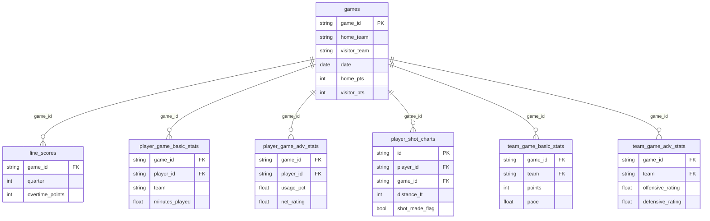
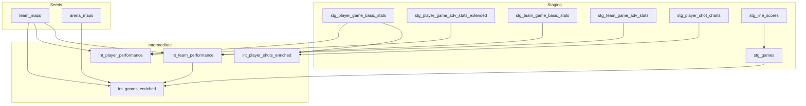

# Interfaces

## Data Source Interface

### DuckDB Connection

The project connects to a single DuckDB database file. Two connection paths exist:

| Consumer | Path | Mode |
|----------|------|------|
| dbt | `../data/DB/dbt_nba.duckdb` (relative to `dbt_nba/`) | Read/Write |
| Evidence BI | `reports/sources/nba/dbt_nba.duckdb` (local copy) | Read-only |
| Streamlit | `dbt_nba/reports/sources/nba/dbt_nba.duckdb` | Read-only |

### Source Schema Contract

dbt expects 7 tables in the `main` schema with the following key constraints:



## dbt Model Interface

### Seed Dependencies

Intermediate models depend on seeds for team/arena conforming:

| Seed | Used By | Join Pattern |
|------|---------|-------------|
| `team_maps` | `int_games_enriched`, `int_player_performance`, `int_team_performance` | `ON team = team_abbr WHERE season_start_year BETWEEN start_year AND end_year` |
| `arena_maps` | `int_games_enriched` | `ON arena = arena_name` |

### Cross-Layer References



## Reporting Query Interface

### Evidence BI Queries

Evidence queries read from the marts and intermediate schemas:

| Query File | Schema | Primary Table |
|-----------|--------|---------------|
| `games.sql` | main_marts | fct_game_results |
| `season_summary.sql` | main_marts | fct_game_results |
| `team_ratings.sql` | main_intermediate | int_team_performance |
| `top_scorers.sql` | main_intermediate | int_player_performance |
| `player_impact.sql` | main_intermediate | int_player_performance |
| `usage_efficiency.sql` | main_intermediate | int_player_performance |
| `play_styles.sql` | main_intermediate | int_team_performance |
| `pace_and_scoring.sql` | main_intermediate | int_team_performance |
| `home_advantage.sql` | main_intermediate | int_games_enriched |
| `game_drama.sql` | main_marts | fct_game_results |
| `competitiveness.sql` | main_marts | fct_game_results |

### Streamlit Query Interface

The Streamlit app queries via `duckdb.connect(DB_PATH, read_only=True)` and uses:
- `main_marts.fct_game_results`
- `main_marts.fct_player_game_stats`
- `main_marts.fct_team_game_stats`
- `main_marts.fct_player_game_shooting`
- `main_intermediate.int_games_enriched`
- `main_intermediate.int_player_performance`

## Pipeline Execution Interface

### Selectors

The `nba_pipeline` selector runs the full DAG via tag union:
```yaml
definition:
  union:
    - method: tag
      value: staging
    - method: tag
      value: intermediate
    - method: tag
      value: dimension
    - method: tag
      value: fact
    - method: tag
      value: marts
```

### Tag-Based Execution

| Tag | Models | Command |
|-----|--------|---------|
| `staging` | All staging views | `dbt build --select "tag:staging"` |
| `intermediate` | All intermediate tables | `dbt build --select "tag:intermediate"` |
| `dimension` | All dimension tables | `dbt build --select "tag:dimension"` |
| `fact` | All fact tables | `dbt build --select "tag:fact"` |
| `marts` | All marts (dim + fact) | `dbt build --select "tag:marts"` |
