# Workflows

## Pipeline Execution

### Full Build (Local)

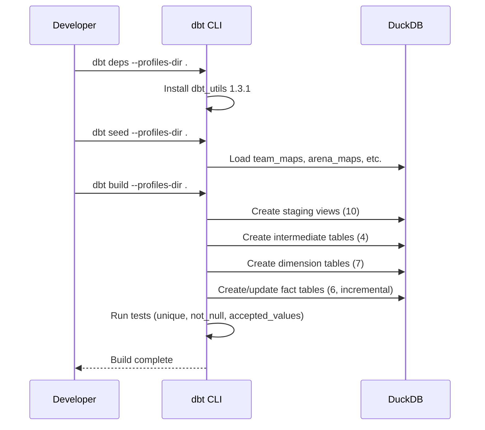

### CI/CD Pipeline (GitHub Actions)

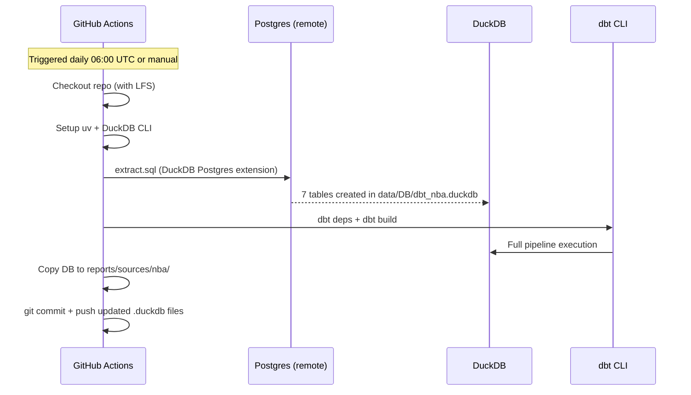

### Extraction Flow

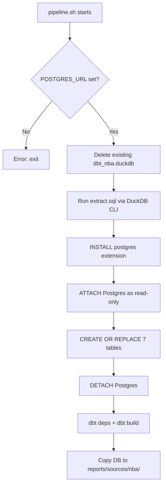

### Incremental Refresh

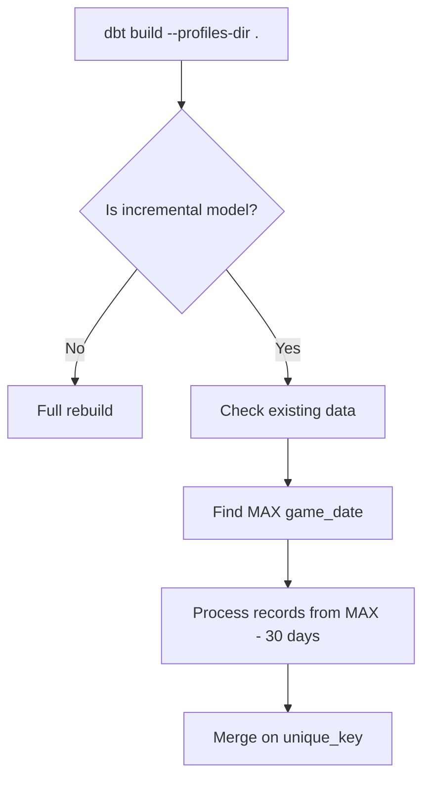

### Selector-Based Execution

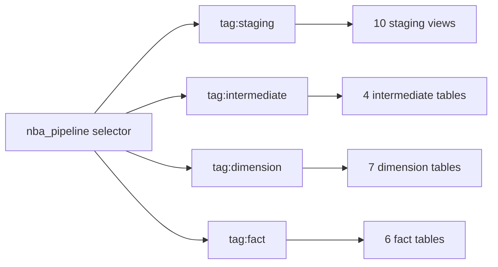

## Data Transformation Flow

### Team Abbreviation Conforming

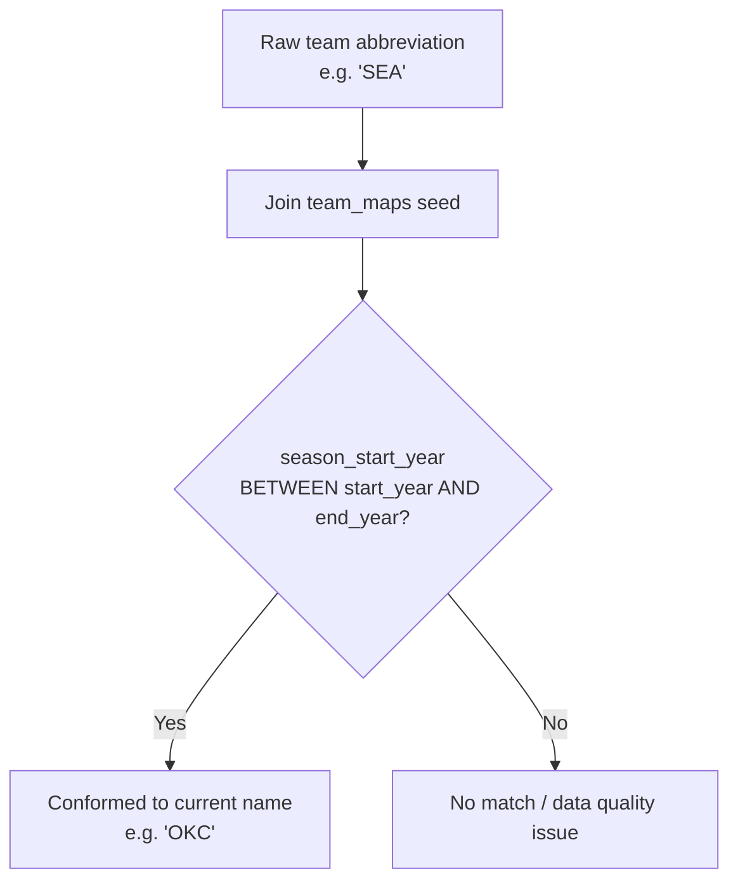

### Player Performance Enrichment

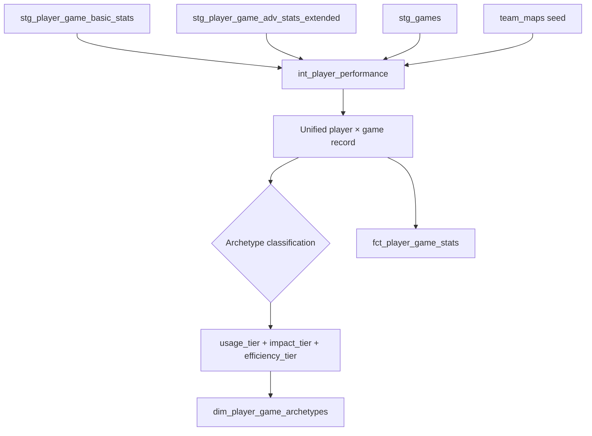

### Shot Data Unification

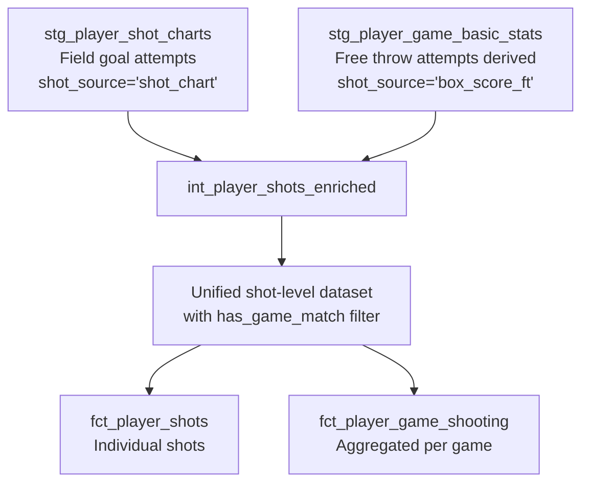

### Dynamic Tiering

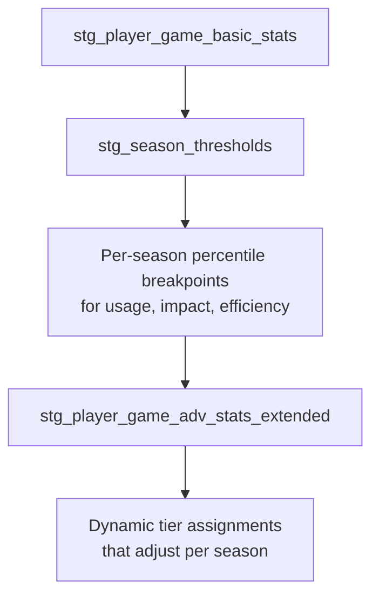

## Development Workflow

### Adding a New Model

1. Create SQL file in appropriate layer directory (`models/staging/`, `models/intermediate/`, or `models/marts/`)
2. Add model definition to relevant YAML (`models/schema.yml` for staging, `models/intermediate/_int_models.yml` for intermediate)
3. Tags are applied automatically via directory config in `dbt_project.yml`
4. Run `dbt build --profiles-dir . --select model_name` to test
5. Update Evidence/Streamlit queries if the model feeds reporting
6. **Note**: No schema YAML exists for marts; tests for dimensions/facts should be added to a new `_marts_models.yml`

### Testing Strategy

- **Source tests**: `unique` and `not_null` on primary/foreign keys in `schema.yml`
- **Model tests**: `unique`, `not_null`, `accepted_values` on key columns
- **Intermediate tests**: `dbt_utils.unique_combination_of_columns` for composite keys
- **Configuration**: `severity: warn`, `store_failures: true` (results stored in `test_results` schema)
- **Gap**: Mart models (dimensions/facts) have no schema YAML or explicit tests

### Running with uv

All dbt commands should be run via `uv run` from the `dbt_nba/` directory:
```bash
uv run --project .. dbt build --profiles-dir .
uv run --project .. dbt test --profiles-dir .
```

## Reporting Refresh

### Evidence BI

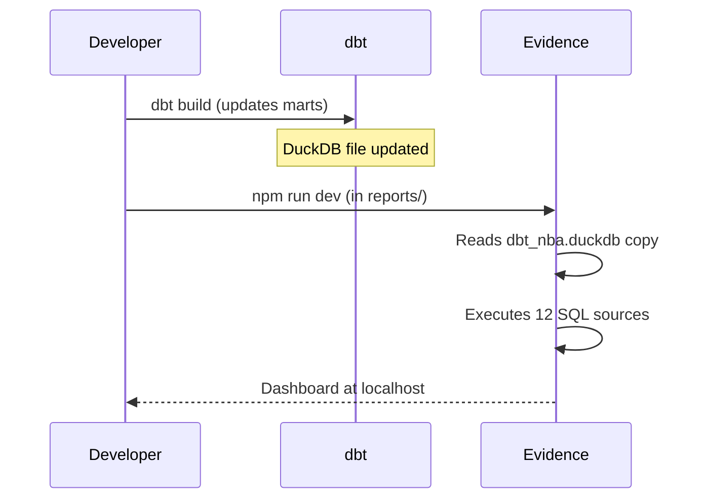

### Streamlit

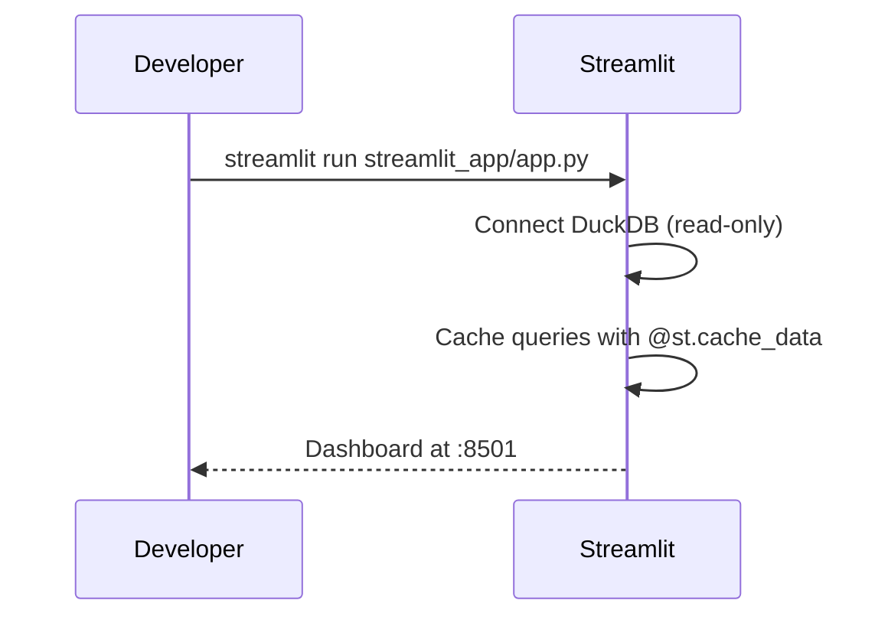

Note: Streamlit reads from the reports copy (`dbt_nba/reports/sources/nba/dbt_nba.duckdb`), so the DB must be copied after dbt build (the pipeline script does this automatically).
