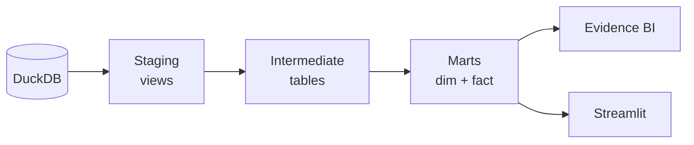

# AGENTS.md

> NBA analytics data warehouse: dbt + DuckDB → star schema → Evidence BI + Streamlit dashboards.

## Directory Map

```
dbt_sample/
├── dbt_nba/                    # dbt project (all transformation logic)
│   ├── models/staging/         # 10 views — clean raw data, derive metrics
│   ├── models/intermediate/    # 4 tables — join/enrich across entities
│   ├── models/marts/dimensions/# 7 tables — descriptive attributes
│   ├── models/marts/facts/     # 6 incremental — measurable events
│   ├── seeds/                  # CSV reference data (team/arena mappings)
│   ├── reports/                # Evidence BI dashboard (Node.js)
│   └── *.yml                   # Config: dbt_project, profiles, selectors, packages
├── streamlit_app/              # Python dashboard (7 pages, Plotly charts)
├── data/DB/dbt_nba.duckdb      # Source database
└── .devcontainer/              # Codespaces config (Python 3.11, auto-starts Streamlit)
```

## Architecture

Three-layer medallion pipeline producing a star schema:



**Materializations**: staging=view, intermediate=table, dimensions=table, facts=incremental (30-day lookback).

## Key Patterns

### Team Abbreviation Conforming
Team names change over time. `seeds/team_maps.csv` has `start_year`/`end_year` columns. All intermediate models join on abbreviation AND season year range:
```sql
LEFT JOIN team_maps ON team = team_abbr
WHERE season_start_year >= start_year AND season_start_year < end_year
```

### Incremental Facts
All 6 fact tables use surrogate keys (`dbt_utils.generate_surrogate_key`) and a 30-day lookback window for idempotent refreshes.

### Shot Data Unification
`int_player_shots_enriched` combines field goal attempts (from shot charts) with free throw attempts (derived from box scores) into a single shot-level dataset with `shot_source` discriminator.

## Model Inventory

| Layer | Models |
|-------|--------|
| Staging | stg_games, stg_line_scores, stg_player_game_basic_stats, stg_player_game_adv_stats, stg_player_game_adv_stats_extended, stg_team_game_basic_stats, stg_team_game_adv_stats, stg_player_shot_charts, stg_season_thresholds, stg_team_season_thresholds |
| Intermediate | int_games_enriched, int_player_performance, int_team_performance, int_player_shots_enriched |
| Dimensions | dim_teams, dim_players, dim_seasons, dim_dates, dim_arenas, dim_shot_zones, dim_player_game_archetypes |
| Facts | fct_game_results, fct_team_game_stats, fct_player_game_stats, fct_quarter_scoring, fct_player_shots, fct_player_game_shooting |

## Configuration

Key variables in `dbt_project.yml`:
- `start_date` / `end_date` — date range filter
- `min_games_played` (10), `min_minutes_per_game` (15) — player inclusion thresholds
- `clutch_time_minutes` (5), `close_game_margin` (5) — clutch game definitions

## Pipeline Execution

All commands run from `dbt_nba/` directory with `--profiles-dir .`:
- Full build: `dbt build --profiles-dir .`
- By layer: `dbt build --profiles-dir . --select "tag:staging"`
- Named selector: `dbt build --profiles-dir . --selector nba_pipeline`
- Seeds: `dbt seed --profiles-dir .`

## Reporting

- **Evidence BI** (`dbt_nba/reports/`): 12 SQL queries in `sources/nba/`, single dashboard page. Reads local DuckDB copy.
- **Streamlit** (`streamlit_app/app.py`): 7 pages (Overview, Teams, Players, Shot Charts, Head to Head, Game Trends, Quarter Analysis). Queries `main_marts.*` and `main_intermediate.*` schemas.

## Dependencies

- `dbt-labs/dbt_utils` 1.3.1 — surrogate keys, composite uniqueness tests
- Python: streamlit 1.45.1, duckdb 1.3.0, plotly 6.1.2

## Detailed Documentation

For deeper information, see `.agents/summary/index.md` which maps to:
- `architecture.md` — design decisions and layer patterns
- `components.md` — model-by-model responsibilities
- `data_models.md` — column-level schema details, ER diagrams
- `interfaces.md` — connection paths, source contracts, query interfaces
- `workflows.md` — pipeline execution, transformation flows, dev workflow
- `dependencies.md` — full dependency graph

## Custom Instructions
<!-- This section is for human and agent-maintained operational knowledge.
     Add repo-specific conventions, gotchas, and workflow rules here.
     This section is preserved exactly as-is when re-running codebase-summary. -->
